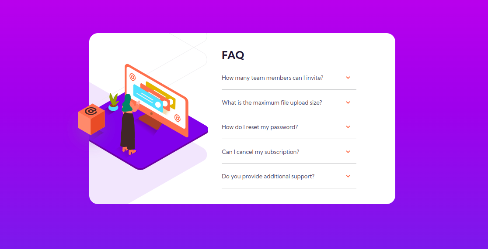

# Frontend Mentor - FAQ accordion card solution

This is a solution to the [FAQ accordion card challenge on Frontend Mentor](https://www.frontendmentor.io/challenges/faq-accordion-card-XlyjD0Oam). Frontend Mentor challenges help you improve your coding skills by building realistic projects. 

## Table of contents

- [Overview](#overview)
  - [The challenge](#the-challenge)
  - [Screenshot](#screenshot)
  - [Links](#links)
- [My process](#my-process)
  - [Built with](#built-with)
  - [What I learned](#what-i-learned)
  - [Continued development](#continued-development)
- [Author](#author)


## Overview

### The challenge

Users should be able to:

- View the optimal layout for the component depending on their device's screen size
- See hover states for all interactive elements on the page
- Hide/Show the answer to a question when the question is clicked

### Screenshot


- Desktop View


- Mobile View

### Links

- Solution URL: [Add solution URL here](https://your-solution-url.com)
- Live Site URL: [Add live site URL here](https://your-live-site-url.com)

## My process

### Built with

- Semantic HTML5 markup
- CSS custom properties
- Mobile-first workflow
- jQuery
- [Boostrap 5](https://getbootstrap.com/docs/5.0/getting-started/introduction/) - CSS Framwork


### What I learned

I learned about the js slideToggle method, and that for it to work an element, the elements display needs to be set to 'none'

```js
  $(selector).slideToggle(500);
```

### Continued development

I'd like to focus more on mastering the flex-box system for responsive designs

## Author

- Frontend Mentor - [@Julius-Java](https://www.frontendmentor.io/profile/julius-java)
- Twitter - [@Julius_Java00](https://www.twitter.com/julius_java00)
